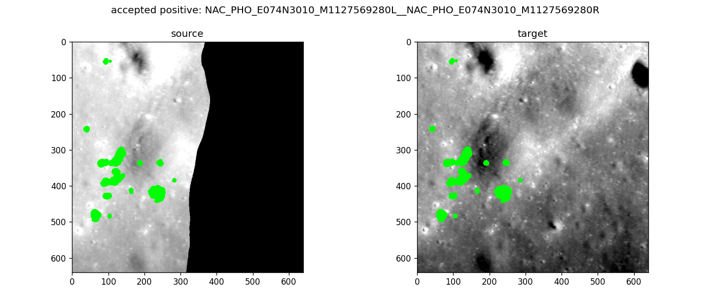
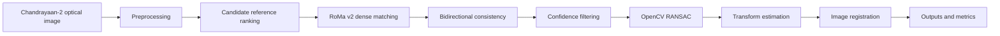
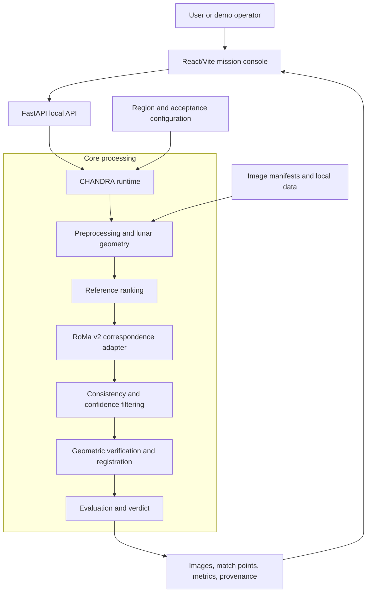
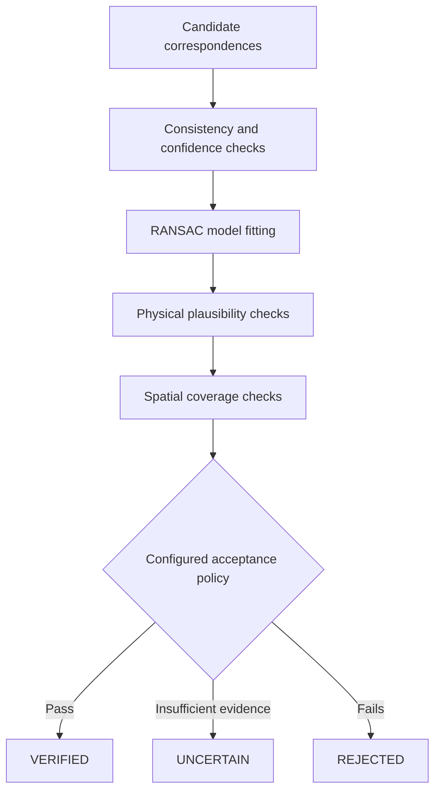
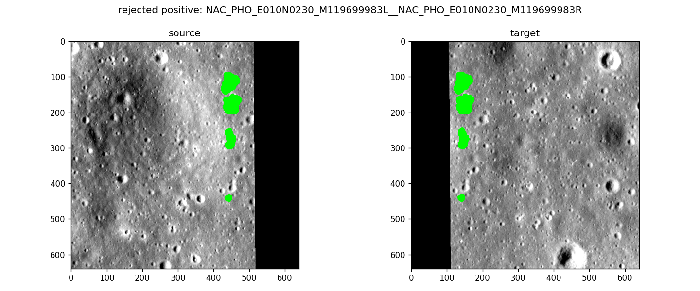
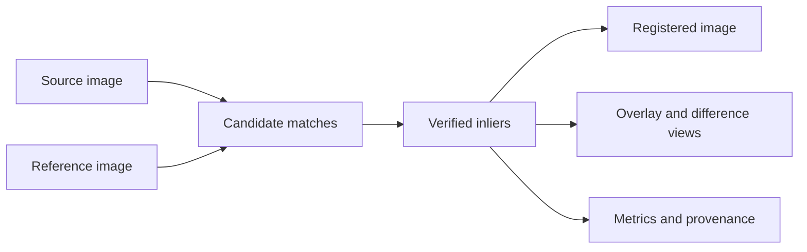

# CHANDRA

### Multi-modal Lunar Image Correspondence & Registration

CHANDRA is a lunar image correspondence and registration system developed in response to **Smart India Hackathon Problem Statement 26166** from the Indian Space Research Organisation (ISRO). It is designed to establish reliable correspondences between Chandrayaan-2 optical imagery and reference lunar imagery despite changes in illumination, viewpoint, sensor characteristics, and scale.

The current implementation combines learned dense matching, consistency checks, robust geometric verification, spatial coverage analysis, and interpretable registration outputs. The production path retains the official RoMa v2 inference behavior; LunarRoMa remains experimental and is not promoted.



*Example of a tracked validation diagnostic showing candidate correspondence points across a lunar image pair.*

## SIH Problem Statement

| Field | Details |
|---|---|
| Problem Statement ID | **26166** |
| Title | **Multi-modal, Sun angle and scale invariant image correspondence using Chandrayaan-2 optical images (OHRC, TMC and IIRS)** |
| Organization | **Indian Space Research Organisation (ISRO)** |
| Department | **Department of Space / Indian Space Research Organisation** |
| Category | **Software** |
| Theme | **Space Technology** |

## The Problem

Image registration aligns a source (moving) image with a reference (fixed) image of the same scene in a common coordinate system. The source image must be geometrically transformed; the reference image supplies the coordinate frame. For lunar imagery, the system must first discover reliable corresponding terrain points, then use those points to estimate and validate the transformation.

The official objective is a generic software solution for finding correspondences between Chandrayaan-2 optical imagery and reference lunar imagery, targeting sub-pixel source-image registration accuracy and spatially uniform correspondence distribution. Expected products include match points, a registered image, and quantitative registration evaluation.

## Why Lunar Registration Is Difficult

### Illumination variation

Sun azimuth, Sun elevation, surface lighting, shadow direction, and shadow length can change substantially between observations. The same crater or ridge may therefore have a very different appearance.

### Viewpoint variation

Different camera positions and orientations can introduce translation, rotation, scale change, and perspective distortion.

### Scale variation

Orbital altitude, spatial resolution, and optical-system differences can create large scale changes between observations, including cross-instrument comparisons.

## Our Approach

CHANDRA treats visual matching as a proposal stage and registration as a separately verified scientific decision:



**Retrieval proposes; geometry decides.** A visually plausible match is not accepted from image similarity or RMSE alone.

## System Architecture



The frontend is a local inspection console, the API exposes the runtime, and the core package owns matching, lunar geometry, verification, registration, evaluation, and provenance. Region Packs and acceptance configuration keep data scope and scientific decision rules explicit.

## Processing Pipeline

The implemented local runtime follows these stages:

1. Validate a map-projected lunar raster and its metadata.
2. Rank eligible regional reference observations with a deterministic normalized intensity descriptor.
3. Extract a common valid crop and run official RoMa v2 dense correspondence.
4. Convert RoMa output to pixel coordinates and filter by overlap confidence and bidirectional consistency.
5. Select a spatially distributed subset of geometrically plausible correspondences.
6. Fit similarity, affine, and homography hypotheses with OpenCV RANSAC, in that order.
7. Check inlier count, inlier ratio, reprojection error, scale, rotation, shear, anisotropy, determinant, grid coverage, and hull coverage.
8. Produce a registration, overlay, absolute difference image, verdict, provenance, and JSON metrics when the configured gates pass.

## Core Technologies

- Python 3.10+
- PyTorch
- Official RoMa v2 for dense learned correspondence
- OpenCV for robust geometric estimation and image remapping
- FastAPI and Uvicorn for the local API
- Rasterio, PyProj, and Shapely for raster metadata and lunar geometry
- React/Vite for the local frontend

### RoMa v2

RoMa v2 is the primary learned correspondence model. It produces dense visual correspondences for terrain that may be difficult for conventional sparse descriptors. RoMa is an upstream model; CHANDRA provides the lunar data contracts, runtime adapter, validation policy, registration logic, provenance, and inspection experience around it.

### Classical baselines

The repository’s current matching path is RoMa-based. The geometry and evaluation modules are structured to support classical feature-match comparisons such as SIFT or ORB where those baselines are added; they are not presented here as the production matcher.

## Geometric Verification

Visual matchers propose correspondences. Geometry determines whether those correspondences can describe the same physical lunar surface.

CHANDRA’s verifier uses **RANSAC (Random Sample Consensus)** to reject outliers and evaluates, in increasing model complexity:

- similarity transforms;
- affine transforms; and
- homographies.

Acceptance also requires configured limits on reprojection error, scale, rotation, shear, anisotropy, transform degeneracy, and spatial coverage. Grid coverage measures how broadly inliers occupy the source image; hull coverage guards against a small local cluster being mistaken for a reliable registration.

The result is a structured `VERIFIED`, `UNCERTAIN`, or `REJECTED` decision. A rejected candidate is a scientific outcome, not a software error.



## Outputs

Depending on the runtime profile and verdict, CHANDRA exposes:

- candidate correspondence points and confidence values;
- verified inlier match lines;
- selected reference and candidate rank;
- estimated transformation parameters;
- registered imagery;
- overlay, split, blink, and absolute-difference views;
- inlier count, inlier ratio, reprojection error, and coverage metrics;
- lunar crop centre and source/reference provenance.

The local frontend provides a mission-console view for correspondence, registration, analysis, model state, region metadata, and provenance.

## Visual Results

### Verified correspondence diagnostic


The tracked diagnostic above makes the matching stage inspectable: the source and reference panels are shown together with the correspondence locations used by the validation run.

### Rejection diagnostic



This example illustrates why visual matches still require geometric verification. The configured protocol can reject a candidate when the evidence does not satisfy the registration gates.

### Registration artifact flow



## Evaluation

The repository calculates or records metrics including:

- RMSE/error statistics where an evaluation protocol provides them;
- number of candidate correspondences;
- inlier count and inlier ratio;
- median, mean, and maximum reprojection error;
- scale, rotation, shear, and anisotropy;
- grid and convex-hull coverage;
- PCK and EPE for dense correspondence evaluation;
- verified registration rate (VRR) and false-accept rate (FAR) for evaluated positive/negative sets.

The current recorded validation baseline uses **20 LRO NAC observations**, with **2 positive and 4 negative evaluated pairs**. Under that project validation protocol, untouched official RoMa v2 recorded VRR **0.5** and FAR **0.0**. This is a small mechanics/validation corpus, not an official SIH benchmark and not evidence of global lunar performance.

The SIH requirement is a target, not a current guarantee: CHANDRA does not claim validated sub-pixel registration across the required Chandrayaan-2 dataset.

## Dataset

CHANDRA is being developed around the datasets defined by SIH Problem Statement 26166.

### Source imagery

The central source imagery is from Chandrayaan-2 optical payloads:

- OHRC
- TMC-2
- IIRS

Dataset portal: [Chandrayaan-2 image browser](https://chmapbrowse.issdc.gov.in/)

The current checked-in repository does not include a Chandrayaan-2 source corpus. Raw imagery and model weights are intentionally excluded from version control.

### Reference imagery

Reference lunar imagery specified by the problem statement may include:

- LRO NAC imagery;
- SELENE imagery.

Relevant resources:

- [LRO image downloads](https://lroc.im-ldi.com/images/downloads/)
- [LRO QuickMap](https://quickmap.lroc.im-ldi.com/)

The available local validation/demo corpus is a small map-projected LRO NAC regional set used to verify mechanics, geometry, provenance, and the presentation path. It is not a substitute for the official Chandrayaan-2 evaluation set.

## Repository Structure

```text
api/             FastAPI metadata and local-demo API
Python package/  Lunar geometry, data, matching, evaluation, and runtime code
configs/         Region, acceptance, training, and demo configuration
data/            Manifests, splits, and ignored local data locations
docs/            Architecture, runbooks, reports, and technical notes
frontend/        React/Vite local mission console
results/         Evaluation reports and verification records
scripts/         Acquisition, dataset, evaluation, packaging, and demo tools
tests/           Regression and scientific-contract tests
Makefile         Formatting, lint, health, and test entry points
```

The Python package directory retains its internal path for compatibility. The user-facing project name is exclusively **CHANDRA**.

## Installation

From a checkout with a supported Python environment:

```bash
python -m venv .venv
.venv/bin/pip install -r requirements.txt -r requirements-dev.txt
.venv/bin/python scripts/doctor.py
```

The project requires Python 3.10 or newer. Use a coherent Python 3.10+ environment with SQLite enabled; the repository’s documented host notes that its system Python 3.14 build lacks SQLite support.

## Running CHANDRA

### Metadata/API workstation

```bash
./scripts/start_workstation.sh
```

This expects a separately prepared local demo bundle. It starts the API at `http://127.0.0.1:8000` and preloads the model before serving the live demo routes.

### Apple Silicon presentation bundle

On the prepared macOS arm64 bundle:

```bash
./scripts/setup_mac_m4.sh
./scripts/start_demo_mac.sh
```

The presentation profile is local and offline after setup, uses the frozen official RoMa v2 checkpoint, and selects MPS when available with CPU fallback. Physical Mac M4 inference, timing, memory, parity, and browser rehearsal remain pending validation.

### Frontend development

```bash
cd frontend
npm install
npm run dev
```

For a production-style static build:

```bash
npm run build
```

## Verification Commands

```bash
make format
make lint
make test
python scripts/doctor.py
```

Focused checks are available through `make test-geo`, `make test-matching`, `make test-training`, and `make test-api`.

## Current Limitations

- The available evaluation corpus is small and does not represent the official Chandrayaan-2 benchmark.
- The current regional validation result is not a global lunar retrieval or localization claim.
- Held-out positive verification is incomplete under the strict acceptance protocol.
- Shadow and crater-semantic hard-negative coverage is incomplete.
- The experimental LunarRoMa/refiner path did not pass the strict no-regression gate and is not promoted.
- The official RoMa v2 path remains the production fallback.
- The Mac M4 hardware validation listed above has not yet been completed.

## Roadmap

- Add validated Chandrayaan-2 OHRC, TMC-2, and IIRS source products.
- Expand geographically isolated positive and hard-negative evaluation sets.
- Improve illumination and cross-sensor robustness without weakening acceptance thresholds.
- Add validated shadow and terrain-semantic negative categories.
- Revisit lunar-specific adaptation only after the coordinate, ground-truth, loss, gradient, overfit, and immutable-baseline gates pass.
- Treat broader visual localization, a larger reference catalogue, DEM-assisted verification, and active perception as future research directions rather than current capabilities.

## Acknowledgements and References

CHANDRA is developed in response to ISRO’s Smart India Hackathon Problem Statement 26166. Chandrayaan-2 source imagery and the reference lunar imagery listed above are governed by their respective data portals and problem-statement terms.

The active dense matcher is the official RoMa v2 implementation. See the [RoMa v2 paper](https://arxiv.org/abs/2511.15706) and the repository’s [integration notes](docs/ROMAV2_INTERNALS.md).

Technical reports covering the current state include the [registration verification notes](docs/REGISTRATION_VERIFICATION.md), [architecture](docs/ARCHITECTURE.md), [demo report](results/RP-001_DEMO_REPORT.md), and [Mac presentation readiness](results/MAC_M4_DEMO_READINESS.md).
