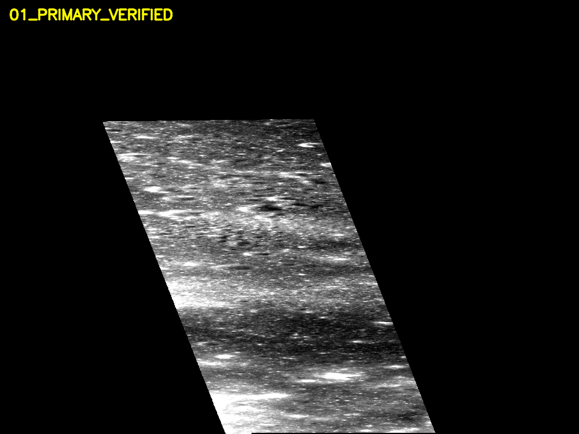
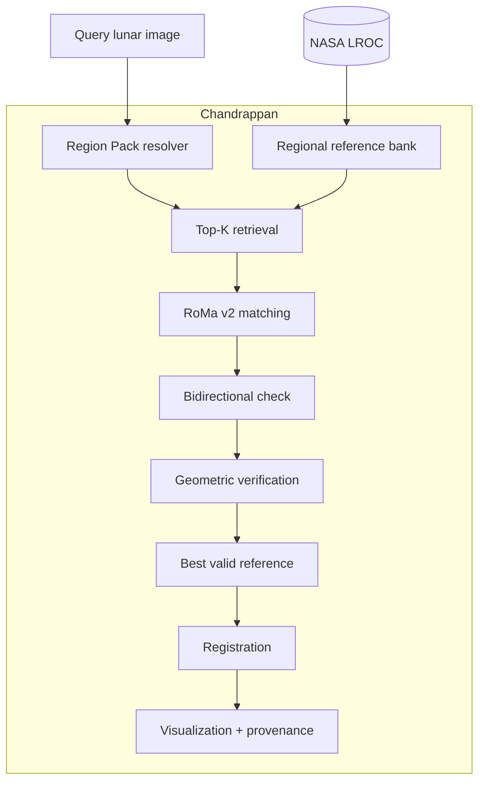

# 🌕 Chandrappan

### Region-Aware Lunar Correspondence & Registration

> Chandrappan retrieves candidate NASA LROC references for a lunar observation, computes dense RoMa v2 correspondences, verifies them geometrically, and exposes an interpretable registration decision.

[](pyproject.toml)
[](requirements.txt)
[](configs/regions/rp001.yaml)
[](docs/ROMAV2_INTERNALS.md)
[](tests)

<p align="center">
  
</p>

## What is Chandrappan?

The same lunar terrain can look radically different across NASA observations: illumination, shadow direction, acquisition geometry, resolution, and sensor conditions all change the image. A visually plausible crater match is not enough.

Chandrappan pairs **regional reference retrieval**, **dense matching**, **geometric verification**, and **scientific provenance** so a registration is an explicit decision rather than an unexamined image similarity score.

## RP-001 — Apollo 15 S-IVB Impact Region

RP-001 is the first Region Pack: a frozen, acquisition-isolated NASA LROC corpus for the Apollo 15 S-IVB Impact site (`E009S3481`). It is a regional experiment—not a claim of unrestricted lunar localization.

| Property | Value |
|---|---:|
| NASA LROC observations | 20 |
| Acquisition split (TRAIN / VALIDATION / TEST) | 12 / 4 / 4 |
| Scientifically valid TRAIN pairs | 19 |
| Dense map-derived GT crops | 97 |
| Map-derived GT pair artifacts | 162 |
| Validated common-pixel exclusions | 47 nominal pairs |

### Frozen held-out demo protocol

| Metric | Official RoMa v2, base-640 protocol |
|---|---:|
| TEST verified-registration rate | **4 / 4** |
| PCK@1 | **82.6%** |
| Median EPE | **0.35 px** |

These are stored, post-freeze base-640 demo metrics from the four RP-001 TEST acquisitions. They do **not** establish global lunar performance or a production acceptance pass. Under the stricter official precise bidirectional acceptance protocol, the production run verifies 2/4 held-out positives and lacks a complete semantic/shadow negative suite; its gate remains incomplete. See the [demo report](results/RP-001_DEMO_REPORT.md) and [final acceptance report](results/RP-001_FINAL_REPORT.md).

## How it works

```mermaid
flowchart LR
    A[Query lunar observation] --> B[Identify Region Pack]
    B --> C[Search NASA LROC reference bank]
    C --> D[Top-K candidate references]
    D --> E[RoMa v2 dense matching]
    E --> F[Bidirectional consistency]
    F --> G[Geometric verification]
    G --> H[Best valid reference]
    H --> I[Registered output]
    I --> J[VERIFIED / UNCERTAIN / REJECTED]
```



**Retrieval proposes; geometry decides.** A query never needs a manually supplied correct reference. Chandrappan searches the TRAIN-only reference bank, evaluates candidate correspondences, then lets geometric evidence—not rank alone—select or reject the result.

## Architecture



## Region Packs

Chandrappan is deliberately scoped. A Region Pack contains repeat observations of one physical lunar region, exact NASA provenance, metadata, a regional reference bank, an acquisition-level split, and its matching/evaluation configuration. This makes scope visible instead of implying a global system where none has been validated.

For RP-001, dense supervision comes from lunar-geospatial **pixel → world → pixel** mapping. It is geospatial correspondence supervision, not surveyed-landmark ground truth. Of the 66 nominal TRAIN combinations, 19 passed the defined common-valid-pixel requirement; 47 were explicitly rejected rather than forced into training.

## Matching stack

| Stage | Role |
|---|---|
| Regional retrieval | Proposes candidate NASA reference views |
| Official RoMa v2 | Computes dense image correspondences |
| Bidirectional check | Tests directional consistency |
| Geometric verification | Rejects coherent-looking false matches |
| Constrained transform | Computes the registration |
| Registration inspector | Shows match lines, overlay, wipe, blink, and difference views |
| Provenance | Retains product identity, split, metadata, URLs, and hashes |

### Registration verdicts

- **VERIFIED** — enough correspondence support and geometric evidence passed the configured checks.
- **UNCERTAIN** — the pipeline cannot support a reliable decision.
- **REJECTED** — the candidate fails verification. Rejection is scientific evidence, not a software error.

## Registration inspector and demo cases

The local inspector provides real match lines, opacity-controlled overlays, draggable wipe, blink, difference views where available, Top-K candidate cards, selected-reference provenance, and a read-only metadata view.

| Frozen case | Expected outcome | Purpose |
|---|---|---|
| Primary held-out | VERIFIED | Main reference-selection and registration walkthrough |
| Difficult illumination | VERIFIED | Shows a real illumination change within the regional scope |
| Failed held-out case | REJECTED | Makes an acceptance limitation visible |
| Other-region hard negative | REJECTED | Demonstrates geometric rejection of an unrelated lunar region |

The full local image pack is intentionally excluded from Git: it contains bulky imagery and is unsuitable for source control. The compact hero preview above is included; the reproducible selection and status are documented in the [handpicked demo report](results/RP-001_HANDPICKED_DEMO_SELECTION.md).

## Scientific provenance

Every RP-001 observation records, where available, its NASA/LROC product ID, acquisition data, incidence/emission/phase, GSD, regional role, split, source URL, and SHA256. The split is at full-acquisition level:

| Safeguard | Status |
|---|---:|
| VALIDATION used for training | 0 |
| TEST used for training or selection | 0 |
| TRAIN-only reference bank | Yes |
| Split leakage check | PASS |

## Model strategy

**Official RoMa v2 — ACTIVE · FROZEN**

RoMa v2 supplies dense correspondence. Chandrappan adds the lunar ingestion, Region Packs, candidate retrieval, correspondence filtering, geometry policy, registration decision, provenance, held-out evaluation, inspection experience, and offline demo deployment around it.

**RP-001 D1 — EXPERIMENTAL · NOT PROMOTED**

D1 changed only the stride-1 refiner using RP-001 TRAIN data. It did not meaningfully improve the monitored held-out criterion, so the live matcher remains the untouched official RoMa v2 baseline.

| Split | Model | PCK@1 | Median EPE | VRR |
|---|---|---:|---:|---:|
| TRAIN | Official | 61.29% | 0.657 px | 16/19 |
| TRAIN | D1 | 61.26% | 0.657 px | 16/19 |
| VALIDATION | Official | 74.59% | 0.478 px | 3/4 |
| VALIDATION | D1 | 74.17% | 0.477 px | 3/4 |
| TEST | Official | 82.57% | 0.348 px | 4/4 |
| TEST | D1 | 82.57% | 0.348 px | 4/4 |

The table uses the same frozen base-640 paired protocol as the demo report. It is not a promotion result or a replacement for the production acceptance protocol.

## Apple Silicon demo

The presentation package targets a **MacBook Air M4 with 16 GB unified memory**. It is local, offline after setup, inference-only, and uses Apple **MPS** when available with CPU fallback. The Mac path uses the frozen Official RoMa v2 model and a local RP-001 bank; D1 weights are excluded.

The M4 bundle and model weights are intentionally not versioned in Git. MPS performance, parity, memory, and browser-rehearsal validation remain pending on the physical presentation machine; no Mac hardware result is claimed here. See [Mac M4 demo readiness](results/MAC_M4_DEMO_READINESS.md).

## Quick start

### Development checkout

```bash
git clone https://github.com/safarhashim007/chandrappan.git
cd chandrappan

python -m venv .venv
.venv/bin/pip install -r requirements.txt -r requirements-dev.txt
.venv/bin/python scripts/doctor.py
.venv/bin/python -m pytest -q
```

### macOS / Apple Silicon presentation bundle

The presentation bundle is a separately transferred, local artifact because it contains the official model and processed imagery. From that prepared bundle on macOS arm64:

```bash
./scripts/setup_mac_m4.sh
./scripts/start_demo_mac.sh
```

Open `http://127.0.0.1:8000`. The setup script installs presentation dependencies; the demo itself runs offline after setup.

## Repository structure

```text
api/             FastAPI presentation API
chandrappan/     Lunar geometry, data, matching, evaluation, and runtime code
configs/         Region Pack, acceptance, training, and demo configuration
docs/            Architecture, runbooks, reports, and compact visual assets
frontend/        Local Chandrappan mission console
results/         Compact scientific evaluation and readiness reports
scripts/         Data, evaluation, packaging, and demo utilities
tests/           Regression and verification suite
```

## Built with

Python, PyTorch, Official RoMa v2, FastAPI, Rasterio, PyProj, Shapely, NASA LROC imagery, and Apple Metal Performance Shaders (MPS) for the macOS presentation path.

## Verification

The current suite contains **65 tests**. Before a change is considered ready, run:

```bash
make format
make lint
make test
python scripts/doctor.py
```

## Current scope

- RP-001 is a small, region-specific evaluation pack; it is not global lunar localization.
- Large illumination and viewpoint changes remain difficult.
- The strict production acceptance evaluation is incomplete: the current official run has 2/4 held-out positive verifications and incomplete shadow/semantic negative coverage.
- D1 was not promoted.
- MPS validation on the target MacBook Air M4 remains pending.

## Technical reports

- [RP-001 final acceptance report](results/RP-001_FINAL_REPORT.md)
- [RP-001 demo report](results/RP-001_DEMO_REPORT.md)
- [Region Pack candidate audit](results/region_pack_candidate_audit.md)
- [Handpicked demo selection](results/RP-001_HANDPICKED_DEMO_SELECTION.md)
- [Mac M4 demo readiness](results/MAC_M4_DEMO_READINESS.md)
- [Architecture](docs/ARCHITECTURE.md) and [registration verification](docs/REGISTRATION_VERIFICATION.md)

## Next

Expand to additional Region Packs, build a larger multi-region corpus, improve photometric robustness and regional retrieval, add validated shadow/semantic hard negatives, and promote a lunar-specific adaptation only when it improves held-out results at a controlled false-accept rate.

## Acknowledgements and references

Chandrappan uses NASA Lunar Reconnaissance Orbiter Camera (LROC) RDR/SDPPHO products. It is not affiliated with NASA. Exact RP-001 product URLs and hashes are preserved in the [Region Pack configuration](configs/regions/rp001.yaml).

RoMa v2 remains the active matching model. The local source inspection checkout identifies the upstream work as Johan Edstedt *et al.*, “RoMa v2: Harder Better Faster Denser Feature Matching,” arXiv:2511.15706 (2025). See the upstream [RoMa v2 paper](https://arxiv.org/abs/2511.15706) and the project’s [RoMa v2 integration notes](docs/ROMAV2_INTERNALS.md).

## License

No license has been published for Chandrappan yet. The included code and NASA/RoMa-related materials remain subject to their respective terms.

> **Chandrappan turns a lunar observation into a traceable registration decision—automatically retrieving candidate NASA references, matching terrain with RoMa v2, verifying geometry, and exposing the result through an interactive inspection console.**
